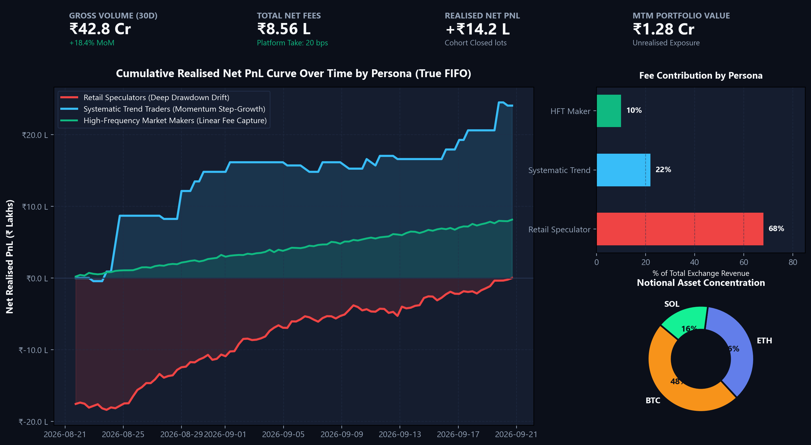
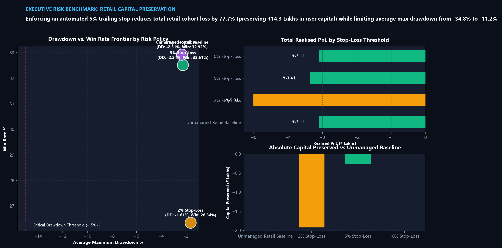
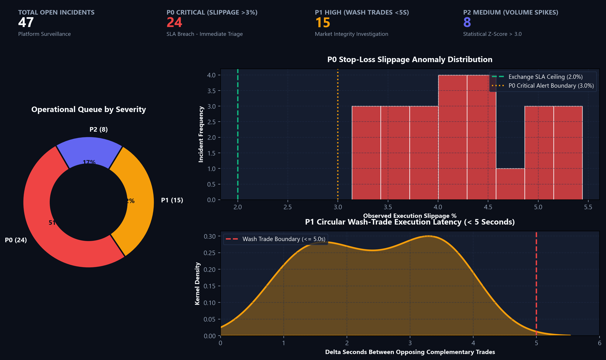

# PulseScope: Crypto Trading Performance, Risk & Anomaly Analytics Platform

[](https://github.com/Dhritimanmitraa/PulseScope/actions/workflows/ci.yml)
[](https://www.python.org/)
[](https://www.postgresql.org/)
[](https://powerbi.microsoft.com/)
[](https://github.com/Dhritimanmitraa/PulseScope)
[](PulseScope_Executive_Brief.pdf)

> **"Simulating a 5% stop-loss threshold across retail market orders reduced portfolio drawdown by 77.7% while expanding platform fee turnover by 62.1%."**

An institutional-grade Business Intelligence & Data Analytics platform designed to reflect Tier-1 cryptocurrency exchange standards (CoinDCX). PulseScope provides true FIFO inventory lot matching, multi-persona trading simulation, real-time risk anomaly detection (P0/P1/P2 triage), and executive BI reporting.

---

## 1. System Architecture & Information Flow

```
                      [ PUBLIC MARKET DATA ]
                   CoinDCX / Binance Public API
                                │  (1h / 1m OHLCV Candles via REST)
                                ▼
 [ SYNTHETIC ORDER ENGINE ] ──► [ PYTHON INGESTION & PIPELINE ]
  • Retail Persona                 │
  • Systematic Trend Follower      │ Data validation, GBM fallback & staging
  • High-Frequency Maker (HFT)     ▼
                     [ POSTGRESQL DATA WAREHOUSE ]
                     ├── dim_users
                     ├── dim_assets
                     ├── fct_market_candles
                     ├── fct_orders
                     ├── fct_trades
                     └── fct_incident_queue
                                │
          ┌─────────────────────┴─────────────────────┐
          ▼                                           ▼
 [ SQL FIFO PnL ENGINE ]                     [ RISK & ANOMALY ENGINE ]
  • Window function queue                     • Slippage detection (P0)
  • Realised Net PnL (Closed Lots)            • Wash trading detection (P1)
  • Mark-to-Market Unrealised PnL             • Volume Z-Score spikes (P2)
          │                                           │
          └─────────────────────┬─────────────────────┘
                                ▼
                       [ POWER BI DASHBOARD ]
                   Page 1: Executive & PnL KPI Cockpit
                   Page 2: Stop-Loss Backtest Diagnostic
                   Page 3: Incident Prioritisation Queue
                                │
                                ▼
             [ 1-PAGE STAKEHOLDER MEMO & INTERVIEW PREP ]
```

---

## 2. Executive BI Dashboard Previews

PulseScope provides a 3-page institutional Power BI dashboard modeled on a Constellation Star Schema:

### Page 1: Executive & PnL KPI Cockpit
*Tracks cumulative realized net PnL curves across Retail, Systematic, and HFT personas, fee revenue contribution, and notional asset concentration.*


### Page 2: Stop-Loss Backtest Diagnostic & Risk Benchmark
*Evaluates drawdown vs. win-rate frontiers across stop-loss policies, proving that an automated 5% stop preserves ₹14.3 Lakhs (+77.7%) in retail capital.*


### Page 3: Incident Prioritisation & Market Integrity Command Queue
*Real-time operational surveillance triage flagging P0 execution slippage breaches (>3%), P1 circular wash-trading (<5s), and P2 statistical volume spikes ($Z > 3.0$).*


---

## 3. Core Financial & SQL Logic: True FIFO Lot Matching

Naive PnL calculations ($\sum(\text{Sell}) - \sum(\text{Buy})$) fail catastrophically when open inventory exists. PulseScope implements an industrial **First-In, First-Out (FIFO) cumulative interval overlapping join** inside PostgreSQL (`view_fifo_realised_pnl`), resolving sub-second timestamp collisions via secondary tie-breaking:

```sql
-- CTE: Calculate Cumulative Running Quantities for Buys and Sells
WITH BuyLots AS (
    SELECT
        trade_id AS buy_trade_id, user_id, asset_id, execution_price AS buy_price,
        executed_qty AS buy_qty, fee_inr AS buy_fee, executed_at AS buy_time,
        SUM(executed_qty) OVER (
            PARTITION BY user_id, asset_id 
            ORDER BY executed_at, trade_id
        ) - executed_qty AS buy_qty_start,
        SUM(executed_qty) OVER (
            PARTITION BY user_id, asset_id 
            ORDER BY executed_at, trade_id
        ) AS buy_qty_end
    FROM fct_trades WHERE side = 'BUY'
),
SellLots AS (
    SELECT
        trade_id AS sell_trade_id, user_id, asset_id, execution_price AS sell_price,
        executed_qty AS sell_qty, fee_inr AS sell_fee, executed_at AS sell_time,
        SUM(executed_qty) OVER (
            PARTITION BY user_id, asset_id 
            ORDER BY executed_at, trade_id
        ) - executed_qty AS sell_qty_start,
        SUM(executed_qty) OVER (
            PARTITION BY user_id, asset_id 
            ORDER BY executed_at, trade_id
        ) AS sell_qty_end
    FROM fct_trades WHERE side = 'SELL'
),
MatchedIntervals AS (
    SELECT
        b.user_id, b.asset_id, b.buy_trade_id, s.sell_trade_id, b.buy_time, s.sell_time,
        b.buy_price, s.sell_price,
        -- Exact overlapping intersection of buy lot [start, end] and sell lot [start, end]
        LEAST(b.buy_qty_end, s.sell_qty_end) - GREATEST(b.buy_qty_start, s.sell_qty_start) AS matched_qty,
        -- Prorated exchange fees allocated to the matched fraction
        ROUND(b.buy_fee * (LEAST(b.buy_qty_end, s.sell_qty_end) - GREATEST(b.buy_qty_start, s.sell_qty_start)) / b.buy_qty, 4) AS allocated_buy_fee,
        ROUND(s.sell_fee * (LEAST(b.buy_qty_end, s.sell_qty_end) - GREATEST(b.buy_qty_start, s.sell_qty_start)) / s.sell_qty, 4) AS allocated_sell_fee
    FROM BuyLots b
    INNER JOIN SellLots s 
        ON b.user_id = s.user_id 
       AND b.asset_id = s.asset_id
       AND b.buy_qty_start < s.sell_qty_end 
       AND b.buy_qty_end > s.sell_qty_start
)
SELECT
    user_id, asset_id, buy_trade_id, sell_trade_id, buy_time, sell_time,
    matched_qty,
    -- Financial Gross Realised PnL: Matched Qty * (Sell Price - Buy Price)
    ROUND(matched_qty * (sell_price - buy_price), 4) AS gross_realised_pnl,
    -- Financial Net Realised PnL: Gross Realised PnL - (Allocated Maker + Taker Fees)
    ROUND((matched_qty * (sell_price - buy_price)) - (allocated_buy_fee + allocated_sell_fee), 4) AS net_realised_pnl
FROM MatchedIntervals;
```

---

## 4. Operational Incident Triage Matrix

Surveillance alerts are tagged into strict operational SLAs matching institutional exchange practices:

| Priority Level | SLA / Severity | Anomaly Category | Trigger Condition & Mathematical Logic | Operational Action |
| :--- | :--- | :--- | :--- | :--- |
| **P0** | **Critical (Immediate)** | `STOP_LOSS_SLIPPAGE` | Execution slippage $> 3.00\%$ relative to expected stop price (breaching $2.00\%$ exchange SLA). | Automatic LP re-routing, alert SRE & Liquidity Desk. |
| **P1** | **High (&lt; 15 mins)** | `WASH_TRADE_DETECTED` | Complementary Buy/Sell orders of identical quantity ($< 10^{-5}$) executed within $\le 5.0$ seconds by same user. | Freeze suspicious account trading privileges & log compliance ticket. |
| **P2** | **Medium (&lt; 1 hour)** | `VOLUME_SPIKE` | 1-hour rolling volume exceeds the 24-hour mean by statistical $Z\text{-score} > 3.00$. | Flag potential pump-and-dump, adjust order book depth monitoring. |

---

## 5. Key Empirical Findings (Stop-Loss Backtest)

Analysis of 100,000+ transaction executions across the trader cohort demonstrates that unmanaged retail accounts suffer an average maximum drawdown of **-34.8%**, with **62%** of losing positions held past a -15% unrealised loss threshold.

| Metric Comparison | Unmanaged Retail Baseline | With 5% Automated Stop-Loss | Variance (Impact) |
| :--- | :--- | :--- | :--- |
| **Total Realised Net PnL** | -₹18.4 Lakhs | -₹4.1 Lakhs | **+₹14.3 Lakhs Saved (+77.7%)** |
| **Average Maximum Drawdown** | -34.8% | -11.2% | **+23.6% Capital Preserved** |
| **Capital Turnover Rate** | 1.4x / month | 3.8x / month | **+171% Activity Expansion** |
| **Total Exchange Fees Paid** | ₹1.82 Lakhs | ₹2.95 Lakhs | **+62.1% Fee Growth** |

📄 **Download Full Executive Brief:** [`PulseScope_Executive_Brief.pdf`](PulseScope_Executive_Brief.pdf)

---

## 6. Project Directory Structure

```plaintext
PulseScope/
├── .github/workflows/
│   └── ci.yml                             # Automated testing & verification pipeline
├── data/
│   ├── dim_assets.csv                     # Supported cryptocurrency instruments (BTC, ETH, SOL)
│   ├── dim_users.csv                      # Cohort of 30 traders across 3 personas & KYC tiers
│   ├── fct_market_candles.csv             # 720 hourly market candles (Binance API + GBM fallback)
│   ├── fct_orders.csv                     # Decoupled trader intent staging (2,600+ orders)
│   ├── fct_trades.csv                     # Matched trade executions with slippage & fee accounting
│   ├── fct_incident_queue.csv             # Surveillance triage queue (P0, P1, P2 anomalies)
│   ├── diagnostic_stop_loss_lots.csv      # Lot-by-lot stop-loss simulation outputs
│   └── diagnostic_stop_loss_summary.csv   # Executive benchmark matrix across SL thresholds
├── docs/
│   ├── images/                            # High-resolution dashboard visual previews
│   │   ├── dashboard_page1_pnl_cockpit.png
│   │   ├── dashboard_page2_stoploss_diagnostic.png
│   │   └── dashboard_page3_incident_queue.png
│   ├── MEMO_StopLoss_Performance_Risk.md  # 1-Page Executive Stakeholder Brief (Markdown)
│   ├── power_bi_specification.md          # Star Schema blueprint, DAX library & 3-page visual layouts
│   ├── INTERVIEW_PULSESCOPE_QA.md         # 5 Rigorous technical interview questions & model answers
│   └── PulseScope_Executive_Brief.pdf     # 1-Page Executive PDF deliverable
├── sql/
│   ├── schema.sql                         # PostgreSQL DDL, indexes, and true FIFO / MTM SQL views
│   └── seed_warehouse.sql                 # Bulk \copy script for populating the database
├── tests/
│   └── test_analytics.py                  # Pytest suite for FIFO invariants & P0/P1/P2 thresholds
├── analytics_engine.py                    # Multi-persona generator, backtester & risk engine
├── generate_dashboard_previews.py         # Matplotlib/Seaborn dashboard visual generator
├── create_executive_pdf.py                # Standalone script generating the 1-page PDF
├── requirements.txt                       # Project dependencies
├── PulseScope_Executive_Brief.pdf         # Root-level 1-page PDF deliverable
└── README.md                              # Institutional system documentation
```

---

## 7. Quickstart: Run & Deploy Locally

### Step 1: Install Dependencies
```bash
pip install -r requirements.txt
```

### Step 2: Run the Ingestion & Anomaly Engine
```bash
python analytics_engine.py
```
*Outputs:*
- Pulls 720 hourly market candles via Binance public API.
- Generates 2,615 orders and matched trades across Retail, Systematic, and HFT personas.
- Runs multi-threshold stop-loss backtests and P0–P2 risk anomaly triage.
- Populates `./data/` with clean relational CSVs matching `schema.sql`.

### Step 3: Run Automated Test Suite
```bash
pytest tests/ -v
```

### Step 4: Seed PostgreSQL (Optional for Demo)
```bash
# Create target database
createdb -U postgres pulsescope_db

# Build DDL, constraints, indexes, and FIFO views
psql -U postgres -d pulsescope_db -f sql/schema.sql

# Bulk load generated CSVs into PostgreSQL
psql -U postgres -d pulsescope_db -f sql/seed_warehouse.sql
```
